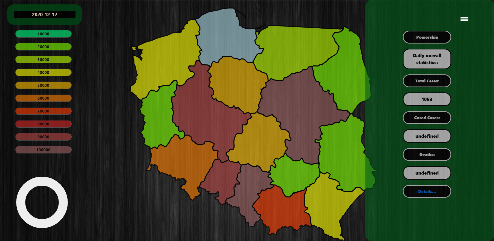
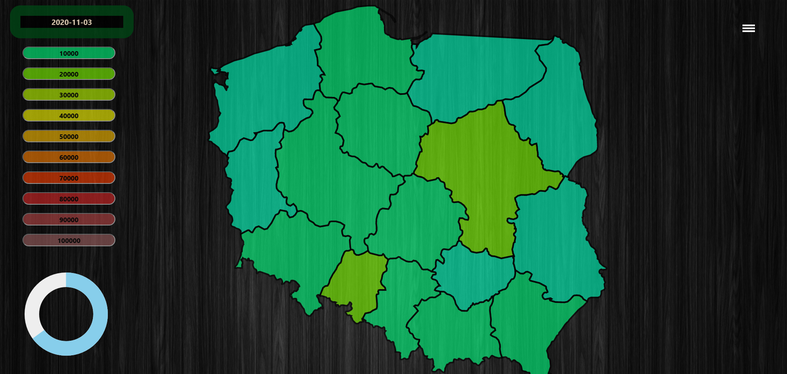
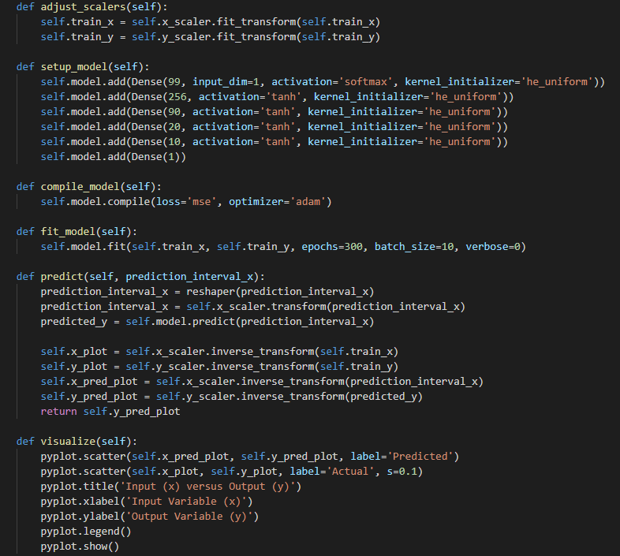
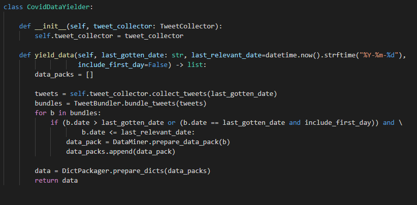
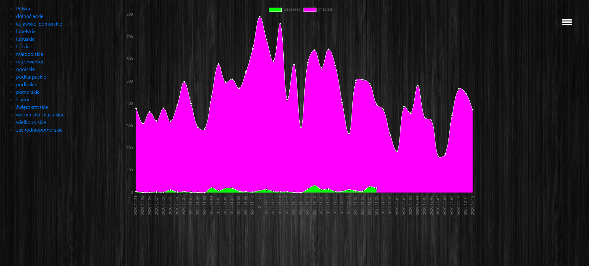
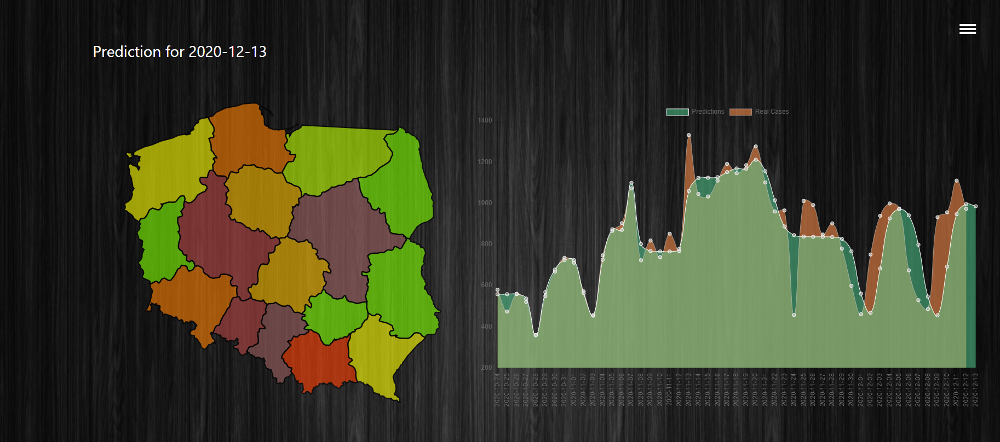

## Covid-19 spread analyzer

## Table of contents

* [Introduction](#Introduction)
* [Launch](#launch)
* [Installation](#installation)
* [General info](#general-info)
* [Code Example](#code-example)
* [Artificial Intelligence](#artificial-intelligence)
* [Technologies](#technologies)

## Introduction
App created for those difficult times, helps people in Poland stay tuned for news about Covid-19. When you become user of this program you'll get access to:

* Responsive Poland map
* Daily positive cases statistics
* Daily death cases statistics
* Daily tests cases statistics
* Available medical tools data

And much more, are You interested?

## Installation
Before you start enjoying this simple app, you have to go through requirements installation. Dont worry, we created Requirements.txt file with all extensions needed to launch server app.

Before launch type in terminal:
"pip install -r requirements"

That's it.

## Launch

To run server type in command line:
"python manage.py runserver"

## General info

When server is running, you have acess to responsive map of Poland (as mentioned before). Each of voivodeships in map, can be checked for Covid-19 info. Also, you have acess to predictions about upcomig days.

## Code Example

## Artificial Intelligence

Here is sample of predictions vs real data, as you can see our team, put a lot of effort to make predictions almost real.

## Technologies

USed techonologies:

* Python 3.8
* Django
* ChartJs
* Tensorflow
* Tweepy
* Keras
* Numpy
* Sklearn
* Scipy
* Firebase_admin

