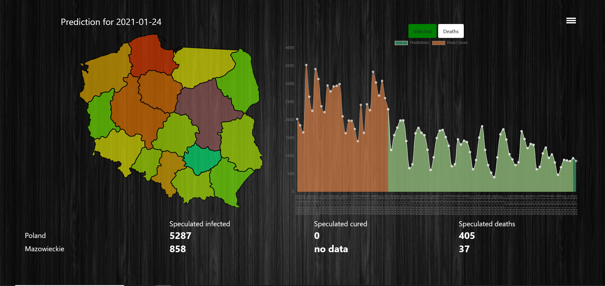

# Covid-19 spread analyzer

## Table of contents

* [Introduction](#Introduction)
* [Launch](#launch)
* [Installation](#installation)
* [General info](#general-info)
* [Code Example](#code-example)
* [Statistics](#statistics)
* [Artificial Intelligence](#artificial-intelligence)
* [Technologies](#technologies)

## Introduction

App created for those difficult times, 
helps people in Poland stay tuned for news about Covid-19. 
When you become user
of this program you'll get access to:

* Responsive Poland map
* Daily positive cases statistics
* Daily death cases statistics
* Daily tests cases statistics
* Available medical tools data
* Overall statistics
* Details (history of deaths/ cured/ infected daily cases )for each voivodeship in Poland

And much more, we hope you are interested :).

## Installation

Before you start enjoying this simple app, you have to go through requirements installation. Dont worry, we created
Requirements.txt file with all extensions needed to launch server app.

Before launch type in terminal:

```shell
pip install -r requirements
```

That's it.

## Launch

To run server type in command line:

```shell
 python manage.py runserver --noreload
 ```

## General info

When server is running,
you have access to responsive map of Poland (as mentioned before). Each of voivodeships in map,
can be checked for Covid-19 info.
Also, you have access to predictions about upcoming days.


Above is an example main page for 12 December.
Map is interactive and after clicking on chosen 
 voivodeship the right general info panel appears and here
we can move on to page focused totally on statistics (for clicked voivodeship).

## Code Example
```javascript
function draw_chart(dates, total_cases, cured_cases, deaths) {
    var ctx = document.getElementById('predictions-graph').getContext('2d');
    var myChart = new Chart(ctx, {
        type: 'line',
        data: {
            labels: dates,
            datasets: [{
                data: total_cases,
                backgroundColor: "rgba(202, 201, 197, 0.5)",
                borderColor: "rgba(202, 201, 197, 1)",
                pointBackgroundColor: "rgba(202, 201, 197, 1)",
                pointBorderColor: "#fff",
                borderWidth: 1,
                label: "Total Cases",
                name: "Total Cases"

            }, {
                data: cured_cases,
                backgroundColor: "rgba(171, 9, 0, 0.5)",
                borderColor: "rgba(171, 9, 0, 1)",
                pointBackgroundColor: "rgba(171, 9, 0, 1)",
                pointBorderColor: "#fff",
                borderWidth: 1,
                label: "Cured Cases",
                name: "Cured Cases"

            }, {
                data: deaths,
                backgroundColor: "rgba(166, 78, 46, 0.5)",
                borderColor: "rgba(12, 74, 0, 1)",
                pointBackgroundColor: "rgba(123, 76, 0, 1)",
                pointBorderColor: "#fff",
                borderWidth: 1,
                label: "Deaths",
                name: "Deaths"

            }]
        },
        options: {
            scales: {
                xAxes: [{
                    ticks: {
                        autoSkip: false,
                        maxRotation: 90,
                        minRotation: 90
                    }
                }]
            }
        }
    });
}
```

## Statistics
Example diagrams in statistics (details section).


## Artificial Intelligence
Sample predictions vs real data below for 27 December. 
You could notice our team put a lot of 
effort to make predictions most efficient and
almost real.


#### Structure of used neural network


## Technologies
- Python 3.8
- Django 3.0+
- ChartJs
- Tensorflow
- Tweepy
- Keras
- Numpy
- Sklearn
- Scipy


